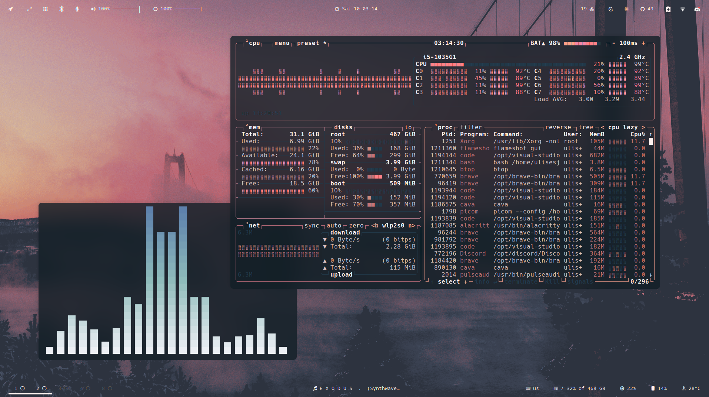
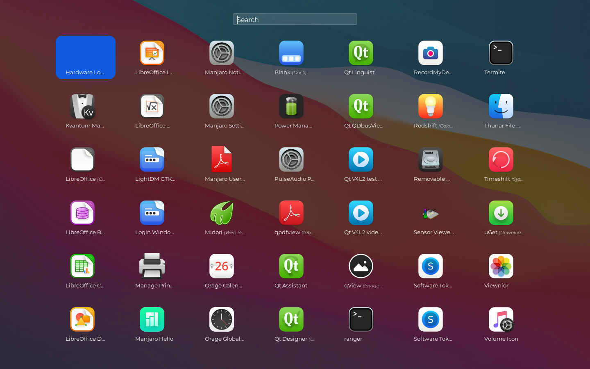
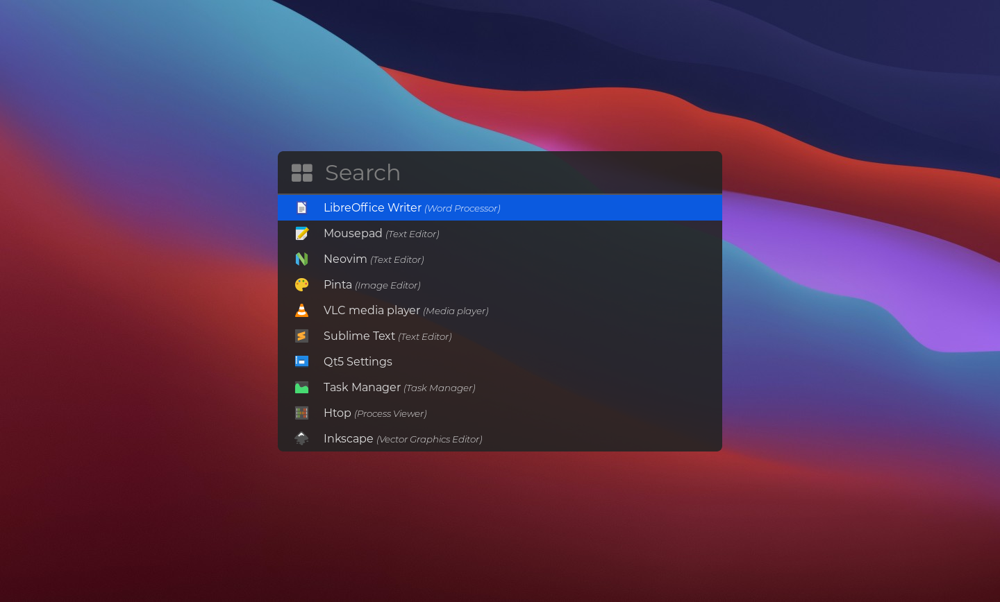

<div align="center">

```ocaml
🚀 NEVER SKIP THE README - YOUR JOURNEY STARTS HERE! 🚀
```

<h1>🏠 HorneroConfig</h1>
<h3>✨ The Ultimate Linux Desktop Configuration Framework ✨</h3>

**Intelligent • Beautiful • Powerful • Seamless**

[📖 Documentation](https://github.com/ulises-jeremias/dotfiles/wiki) •
[🎨 Gallery](#-gallery) •
[🚀 Quick Start](#-quick-installation) •
[🤝 Contributing](CONTRIBUTING.md)

<div align="center">
  <a href="https://github.com/ulises-jeremias/dotfiles-template">
    
  </a>
</div>

<div align="center">
  <a href="https://github.com/ulises-jeremias/dotfiles/tree/x11-openbox-i3wm-xfce4">
    
  </a>
</div>

[](https://github.com/PandaFoss/Awesome-Arch)
[](https://aur.archlinux.org/packages/dots-stable)
[](https://aur.archlinux.org/packages/dots-git)
[](LICENSE)
[](https://archlinux.org/)

</div>

---

## 🌟 What is HorneroConfig?


**HorneroConfig** is a cutting-edge dotfiles framework that transforms your Linux desktop into a masterpiece of functionality and beauty. Named after the industrious hornero bird 🐦, renowned for its skillful nest-building, this framework empowers you to craft the perfect digital workspace.

### ✨ Highlights

🧠 **Smart Color Intelligence** — Automatic theme-aware color adaptation  
🎨 **12+ Beautiful Themes** — Stunning pre-configured rice themes  
⚡ **One-Command Setup** — From zero to hero in minutes  
🌊 **Hyprland/Wayland** — Modern compositor with smooth animations  
🔧 **100+ Automation Scripts** — Comprehensive tooling ecosystem  
🛡️ **Security-First** — Built-in auditing and hardening  
📦 **Zero Maintenance** — Powered by chezmoi for seamless updates

<br clear="right"/>

---

## 🎨 Gallery

<details>
<summary>🖼️ <b>Click to view screenshots</b></summary>

<div align="center">

### 🌙 Dark Theme



### ☀️ Light Theme


### 🚀 Application Launchers

 

</div>

</details>

---

## 🚀 Quick Installation

### ⚡ One-Line Install (Recommended)

```bash
sh -c "$(curl -fsSL "https://github.com/ulises-jeremias/dotfiles/blob/main/scripts/install_dotfiles.sh?raw=true")"
```

### 📦 Arch Linux (AUR)

```bash
yay -S dots-stable      # Stable release
yay -S dots-git         # Latest features
```

> 💡 **Performance Tip**: HorneroConfig automatically configures [Chaotic-AUR](https://aur.chaotic.cx/) during installation, providing precompiled binaries for popular AUR packages (Hyprland ecosystem, nwg-* tools, etc.) to significantly reduce installation time.

<details>
<summary>🛠 <b>More installation methods</b></summary>

#### Using Chezmoi

```bash
chezmoi init --apply ulises-jeremias --source ~/.dotfiles
```

#### From Source

```bash
git clone https://github.com/ulises-jeremias/dotfiles ~/.dotfiles
~/.dotfiles/install.sh
```

#### Manual AUR Build

```bash
git clone https://aur.archlinux.org/dots-stable.git /tmp/dots-stable
cd /tmp/dots-stable && makepkg -si
```

</details>

---

## 💎 Key Features

### 🧠 Revolutionary Smart Colors System

Our **game-changing smart colors technology** automatically analyzes your color palette and intelligently selects optimal colors for UI elements:

✨ **Semantic Intelligence** — Error, success, warning, info colors that make sense  
🎨 **Theme Adaptation** — Perfect contrast and readability on any background  
⚡ **Auto-Application** — Instantly applies to Waybar, EWW, Hyprland, and scripts  
🔄 **Live Updates** — Colors refresh automatically when you change wallpapers

> 📖 [Learn more about Smart Colors →](https://github.com/ulises-jeremias/dotfiles/wiki/Smart-Colors-System)

### 🎨 Rice System & Themes

Choose from **12+ stunning themes** spanning nature, retro, cyberpunk, and cosmic aesthetics:

```bash
dots rofi-rice-selector     # Interactive theme picker 🎯
dots rice apply flowers     # Apply a specific theme
dots rice list              # See all available themes
```

> 📖 [Explore all themes →](https://github.com/ulises-jeremias/dotfiles/wiki/Rice-System-Theme-Management)

### 🔧 Core Stack

🌊 **[Hyprland](https://hyprland.org)** — Dynamic tiling Wayland compositor  
📊 **[Waybar](https://github.com/Alexays/Waybar)** — Beautiful dual-bar status bar with 20+ modules  
🚀 **[Rofi](https://github.com/lbonn/rofi)** — Lightning-fast app launcher (Wayland fork)  
🔔 **[Mako](https://github.com/emersion/mako)** — Lightweight notification daemon  
🐾 **[Kitty](https://sw.kovidgoyal.net/kitty)** — GPU-accelerated terminal emulator  
🐚 **[Zsh](https://zsh.org) + [Powerlevel10k](https://github.com/romkatv/powerlevel10k)** — Feature-rich shell with beautiful prompt  
🎛️ **[EWW](https://github.com/elkowar/eww)** — Modern system widgets (dashboard & powermenu)  
🔒 **[Hyprlock](https://github.com/hyprwm/hyprlock)** — Secure lock screen  
🖼️ **[Hyprpaper](https://github.com/hyprwm/hyprpaper)** — Fast wallpaper daemon  
🎨 **Rice System** — Instant theme switching

> 📖 [Complete component list →](https://github.com/ulises-jeremias/dotfiles/wiki/Home)

### 🛠️ Powerful Automation

Access **100+ built-in scripts** via the `dots` command:

```bash
dots scripts            # Interactive script browser
dots sysupdate          # Comprehensive system updates
dots smart-colors       # Intelligent color analysis
dots security-audit     # Security analysis and hardening
dots rofi-rice-selector # Visual theme picker
```

📂 `dots-eject` — Export configs for manual use  
🔄 `dots-update` — Sync with upstream changes

> 📖 [Scripts documentation →](https://github.com/ulises-jeremias/dotfiles/wiki/Dots-Scripts)

---

## 🧪 Development & Testing

### 🎮 Safe Testing Environment

Try HorneroConfig risk-free with our Vagrant playground:

```bash
git clone https://github.com/ulises-jeremias/dotfiles && cd dotfiles
./bin/play                        # Start VM
./bin/play --provision hyprland   # Provision with Hyprland
./bin/play --remove               # Clean up
```

> 📖 [Testing guide →](docs/Testing-Strategy.md)

### 🔧 Contributing

We use [pre-commit](https://pre-commit.com/) for code quality:

```bash
pipx install pre-commit           # Install pre-commit
cd ~/.dotfiles && pre-commit install   # Set up hooks
pre-commit run --all-files        # Run all checks
```

> 🤝 [Contributing guide →](CONTRIBUTING.md) | [Development standards →](docs/Development-Standards.md)

---

## 📖 Documentation

### 📚 For Users

🏠 [**Getting Started**](https://github.com/ulises-jeremias/dotfiles/wiki/Home) — First steps and basic setup  
🎨 [**Rice System**](https://github.com/ulises-jeremias/dotfiles/wiki/Rice-System-Theme-Management) — Theme management  
🧠 [**Smart Colors**](https://github.com/ulises-jeremias/dotfiles/wiki/Smart-Colors-System) — Intelligent theming  
📊 [**Waybar**](https://github.com/ulises-jeremias/dotfiles/wiki/Waybar-Configuration) — Status bar configuration  
🎛️ [**EWW Widgets**](https://github.com/ulises-jeremias/dotfiles/wiki/EWW-Widgets) — System widgets  
🔧 [**Scripts**](https://github.com/ulises-jeremias/dotfiles/wiki/Dots-Scripts) — Automation tools  
🛡️ [**Security**](https://github.com/ulises-jeremias/dotfiles/wiki/Security) — Privacy and security

### 🤖 For Developers & AI Agents

📋 [**AGENTS.md**](AGENTS.md) — Quick reference guide  
🏗️ [**Architecture**](docs/Architecture-Philosophy.md) — Design principles  
📐 [**ADRs**](docs/adrs/) — Architecture decisions  
🔒 [**Security**](docs/Security-Guidelines.md) — Security practices  
⚡ [**Performance**](docs/Performance-Guidelines.md) — Optimization strategies

---

## 🌍 Platform Support

🐧 **Arch Linux** — Full support with AUR packages  
🐧 **Ubuntu/Debian** — Supported (manual dependencies)  
🐧 **Fedora/RHEL** — Supported (manual dependencies)  
☁️ **Cloud Dev** — GitHub Codespaces, Gitpod, VS Code Remote

> 📖 [Platform-specific guides →](https://github.com/ulises-jeremias/dotfiles/wiki/Home)

---

## 🤝 Contributing

We welcome all contributions! 🎉

🐛 Bug reports • ✨ Feature requests • 🎨 New themes • 📚 Documentation • 🔧 Code

<div align="center">

### 🌟 Contributors

<a href="https://github.com/ulises-jeremias/dotfiles/contributors">
  
</a>

</div>

---

<div align="center">

### 💝 Show Your Support

If HorneroConfig has improved your Linux experience:

⭐ **[Star this repo](https://github.com/ulises-jeremias/dotfiles)** • 🐦 **Share it** • 🤝 **Contribute**

<br>

**🏠 HorneroConfig**  
*Building the perfect digital nest, one configuration at a time*

<sub>Licensed under [MIT License](LICENSE) • Made with ❤️ for the Linux community</sub>

</div>
