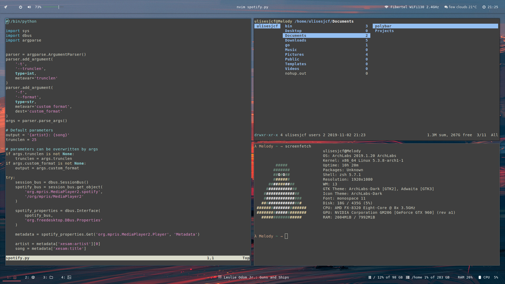

# Dotfiles

My personal dotfiles for i3, polybar, fgmenu, compton, ...

## How it looks




## Installation

```sh
$ git clone https://github.com/ulises-jeremias/dotfiles /tmp/dotfiles
$ cd /tmp/dotfiles
$ ./install [--os <os>] [-l <file_path>] [--dotfiles-dir <dir_path>] [--no-deps]
```

The installation script will install all the necessary dependencies that allow your dotfiles config work correctly.

<details><summary>Installation args</summary>

- `<os> = common | arch-linux | debian | ...` where common is supposed to work correctly with any linux distro. `common` is set as default value for this flag.
- `<file_path>` is `/tmp/install_progress_log_$(date +'%m-%d-%y_%H:%M:%S').txt` as default.
- `<dir_path>` is `~/dotfiles` as default.

</details>

## Customization

There is no need to fork this repository in order to customize it. Everything can be customized by leveraging the `custom-configs` directory. You are encouraged to maintain a separate github repository of configurations for your own dotfiles.

The custom-configs directory is intended to be the central location for all of your customizations. It is recommended that you maintain a github repository of your configurations. You may add the contents to the `custom-configs` like so;

```sh
$ cd <dotfiles_dir>/custom-configs
$ git init
$ git remote add origin git@github.com:your-username/your-custom-configs-repo.git
$ git pull origin master
```

### Zsh

Any file in your `<dotfiles_dir>/custom-configs` directory ending with `.sh` will automatically be sourced when you open a shell. You can use this to add additional alias, functions, etc.

For example, you can create the file `<dotfiles_dir>/custom-configs/paths.sh` with the following content.

```sh
# custom exports

export LD_LIBRARY_PATH=/usr/local/lib
export PATH="$(yarn global bin):$HOME/bin:$HOME/.local/bin:$PATH"

export NVM_DIR="$HOME/.config"
[ -s "$NVM_DIR/nvm.sh" ] && \. "$NVM_DIR/nvm.sh"  # This loads nvm
[ -s "$NVM_DIR/zsh_completion" ] && \. "$NVM_DIR/zsh_completion"  # This loads nvm zsh_completion
```

This file will be automatically sourced.

### NeoVim

Not yet

## Misc Customization

You can use your own configuration file in place of any of the following

- gitconfig

To do so you just need to include a file of the same name in your version controlled directory that you save into `custom-configs` the create symlinks scripts will link the files properly.

To add configuration files after the installation process you should only run the command `<dotfiles_dir>/default-config/install` after having modified the contents of the directory `<dotfiles_dir>/custom-config`.
