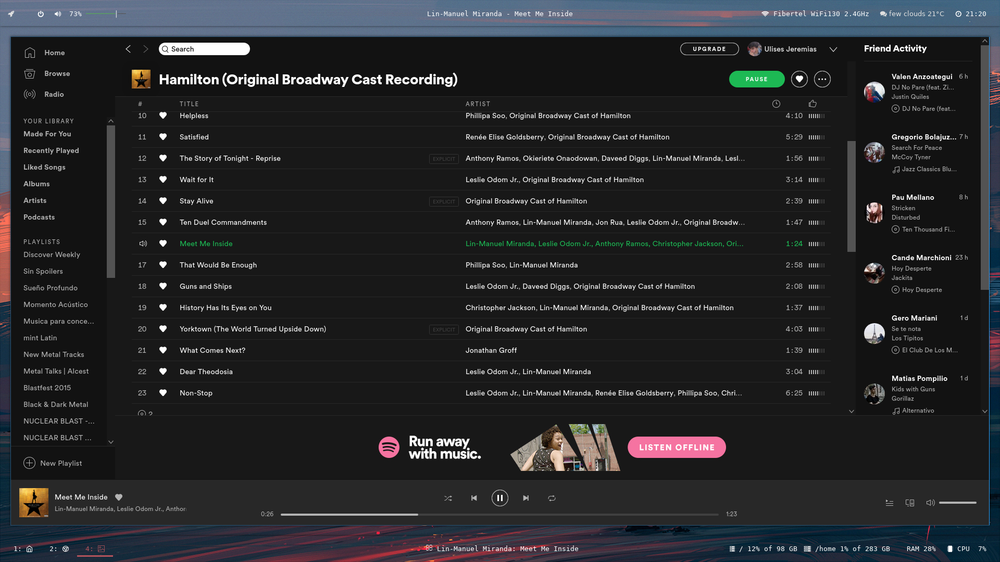
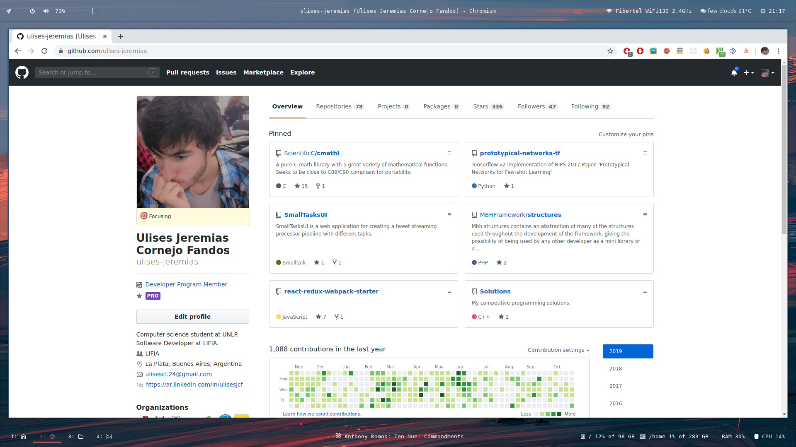

# Dotfiles

My personal dotfiles for i3, polybar, fgmenu, compton, ...

## Install

```sh
$ git clone https://github.com/ulises-jeremias/dotfiles /tmp/dotfiles
$ cd /tmp/dotfiles
$ ./scripts/install [--os <os>] [-l <file_path>] [--dotfiles-dir <dir_path>]
```

```sh
<os> = arch-linux | ...
<file_path> is /tmp/install_progress_log_$(date +'%m-%d-%y_%H:%M:%S').txt as default
<dir_path> is ~/dotfiles as default
```

## Screenshots

### Home


### Spotify sync

You can see the playing song at the bottom of your screen.



### Terminals


### App sample



