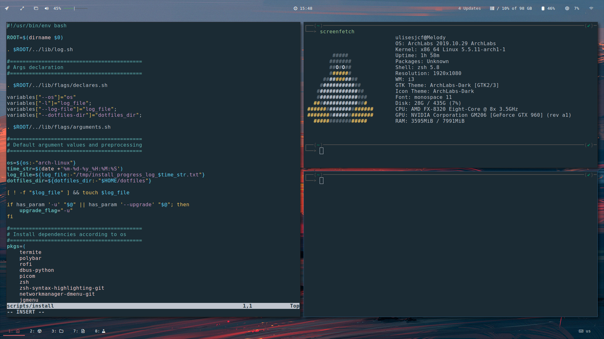

# Dotfiles

Dotfile generator that allows quick configuration of different window managers in multiple OSs.

- [Dotfiles](#dotfiles)
  - [How it looks](#how-it-looks)
  - [Installation](#installation)
  - [Customization](#customization)
  - [Testing](#testing)

## How it looks

<center>





</center>

## Installation

```sh
$ git clone https://github.com/ulises-jeremias/dotfiles /tmp/dotfiles
$ cd /tmp/dotfiles
$ ./install --wms=<WMS> # use -h to know more about install options
```

being `WMS = i3,openbox,...`.

The installation script will install all the necessary dependencies that allow your dotfiles config work correctly.

## Customization

There is no need to fork this repository in order to customize it. Everything can be customized by leveraging the `custom-config` directory. You are encouraged to maintain a separate github repository of configurations for your own dotfiles.

The custom-config directory is intended to be the central location for all of your customizations. It is recommended that you maintain a github repository of your configurations. You may add the contents to the `custom-config` like so;

```sh
$ cd <dotfiles_dir>/custom-config
$ git init
$ git remote add origin git@github.com:your-username/your-custom-config-repo.git
$ git pull origin master
```

To apply configuration files after the installation process you should only run the command `<dotfiles_dir>/default-config/install` after having modified the contents of the directory `<dotfiles_dir>/custom-config`.

Read more about this at [customization docs](https://github.com/ulises-jeremias/dotfiles/wiki/Customization).

## Testing

Maybe you want to contribute to this project or just test what the setup would look like before installing it. For this we develop test environments in which you can see how the changes look!

To run testing environment just run the following commands;

```sh
$ git clone https://github.com/ulises-jeremias/dotfiles /tmp/dotfiles
$ cd /tmp/dotfiles
$ ./bin/test --os=<OS> --wms=<WMS> # use -h to know more about install options
```

being `OS = arch-linux | debian` and `WMS = i3,openbox,...`.

You can read more about this at [testing docs](https://github.com/ulises-jeremias/dotfiles/wiki/Testing).
