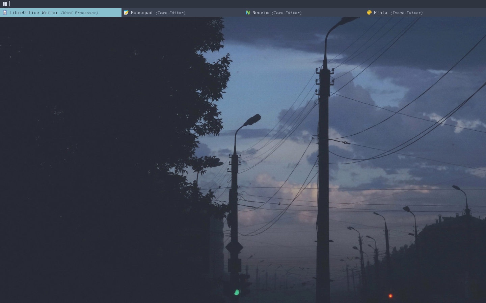

<div align="justify">

<div align="center">

<h1>Dotfiles Generator</h1>

[Docs](https://github.com/ulises-jeremias/dotfiles/wiki) |
[Changelog](#) |
[Contributing](https://github.com/ulises-jeremias/dotfiles/blob/master/.github/CONTRIBUTING.md)

</div> <!-- center -->
<div align="center">

[](https://github.com/PandaFoss/Awesome-Arch)
[](https://aur.archlinux.org/packages/dots-stable)
[](https://aur.archlinux.org/packages/dots-git)
[![License: MIT][licensebadge]][licenseurl]

</div> <!-- center -->

<h1>
  <a href="#--------">
    
  </a>
</h1>

### :octocat: ‎ <sup><sub><samp>HI THERE! THANKS FOR DROPPING BY!</samp></sub></sup>

<a href="#octocat--hi-there-thanks-for-dropping-by">
  <picture>
    <source media="(prefers-color-scheme: dark)" alt="" align="right" width="400px" srcset="./static/screen-2.jpg"/>
    
  </picture>
</a>

You might be here looking for (Linux) rice reference or to (full?) replicate my personal
configuration of my favorites Window Managers and several apps as well. :snowman:

Most were written from scratch. Some details:

- **Window Manager** :bento: [i3](https://i3wm.org) and/or [Openbox](http://openbox.org/wiki/Main_Page) and/or [XFCE](https://www.xfce.org/)!
- **Panel** :blossom: [Polybar](https://polybar.github.io/)!
- **Application Launcher** :rocket: [Rofi](https://github.com/davatorium/rofi) which blazing fast!
- **Desktop Notification** :herb: [Dunst](https://github.com/dunst-project/dunst) which minimalist!
- **Terminal Emulator** :leaves: [Alacritty](https://alacritty.org/) which GPU accelerated!
- **Shell** :shell: [Zsh](https://zsh.org) with several post-installation tweaks!
- **Compositor** :shaved_ice: [Picom](https://github.com/yshui/picom) for perfection topping!
- **File Manager** :flower_playing_cards: [Thunar](https://docs.xfce.org/xfce/thunar/start) customized side-pane!
- and many more!

<h1>
  <a href="#---------1">
    
  </a>
</h1>

<br>

<div align="center">

```ocaml
CLICK OR TAP ❲☰❳ TO SHOW TABLE-OF-CONTENTS
```

</div> <!-- center -->

</div> <!-- justify -->

Dotfiles generator that allows quick configuration of different window managers in multiple OSs.

## Installation

### From the Arch-Linux User Repository (AUR)

- Using a helper like [yay](https://github.com/Jguer/yay)

  Install [dots-stable](https://aur.archlinux.org/packages/dots-stable/)

  ```sh
  yay dots-stable
  dots --help
  ```

  or install the rolling release [dots-git](https://aur.archlinux.org/packages/dots-git/)

  ```sh
  yay dots-git
  dots --help
  ```

- Using `makepkg`

  Install [dots-stable](https://aur.archlinux.org/packages/dots-stable/)

  ```sh
  git clone https://aur.archlinux.org/dots-stable.git /tmp/dots-stable
  cd /tmp/dots-stable
  makepkg -si
  dots --help
  ```

  or install the rolling release [dots-git](https://aur.archlinux.org/packages/dots-git/)

  ```sh
  git clone https://aur.archlinux.org/dots-git.git /tmp/dots-git
  cd /tmp/dots-git
  makepkg -si
  dots --help
  ```

### From source

> Use this for any OS that is not `Arch Linux` or `Arch Linux based distro`.
> This will install unstable versions of the dotfiles generator. You can switch to a stable version by using any existing git tag.

```sh
git clone https://github.com/ulises-jeremias/dotfiles /tmp/dotfiles
cd /tmp/dotfiles
sudo ./install
dots --help
```

The installation script allows you to install all the necessary dependencies that allow your dotfiles config work correctly.

## Post install customization

There is no need to fork this repository in order to customize it. Everything can be customized by leveraging the generated dotfiles directory. You are encouraged to maintain a separate github repository of configurations for your own dotfiles.

Read more about this at [Customization Docs](https://github.com/ulises-jeremias/dotfiles/wiki/#Customization).

### Examples

<div class="container">
  
  
  
  
  
  
</div>

## Testing

We have different testing environments that allow us to test the dotfiles generator in different OSs and window managers.

### Docker and Xephyr

To run the testing environment just run the following commands;

```sh
git clone https://github.com/ulises-jeremias/dotfiles /tmp/dotfiles
cd /tmp/dotfiles

# start the docker compose env
./bin/play --docker

# use -h to know more about the available options
```

### Vagrant

To run the testing environment just run the following commands;

```sh
git clone https://github.com/ulises-jeremias/dotfiles /tmp/dotfiles
cd /tmp/dotfiles
cd ./playground/vagrant/<os>/

# start the VM
./bin/play --vagrant

# provision the VM
./bin/play --vagrant --provision

# remove the VM
./bin/play --vagrant --remove

# use -h to know more about the available options
```

## Repository Structure

```sh
.
├── .github                 # github related files
├── arch-linux              # Arch Linux override files (used by dots when installing in Arch Linux based distros)
│   ├── bin/                # binaries to be installed in Arch Linux based distros
│   ├── deps.sh             # Arch Linux specific dependencies
│   └── install-pkgs.sh     # Arch Linux specific script to install packages from the AUR and the official repos
├── bin/                    # Useful binaries
│   └── play                # script to run the testing environments
├── common                  # common files (used by dots when installing in any OS)
│   ├── bin/                # common binaries to be installed in any OS
│   ├── config/             # common config files to be installed in any OS
│   └── install             # script installed by dots at <dotfiles_dir>/install
├── debian                  # Debian override files (used by dots when installing in Debian based distros)
│   ├── bin/                # binaries to be installed in Debian based distros
│   ├── deps.sh             # Debian specific dependencies
│   └── install-pkgs.sh     # Debian specific script to install packages from the official repos and other sources
├── playground              # testing environments
│   └── docker/             # docker setup to bootstrap the testing environments
│   └── vagrant/            # vagrant setup to bootstrap the testing environments
├── scripts                 # scripts used by dots to install the dotfiles
│   └── install-pkgs        # script to install packages from the official repos and other sources
│   ├── install-dotfiles    # script to install the dotfiles in the system
│   └── install             # main installation script
├── static/                 # static files used by the README
├── ui/                     # ui files used by dots when installing in interactive mode - WIP
├── util/                   # util files used by dots
├── dots                    # dots binary to install the dotfiles
└── install                 # installation `dots` binary in the system
```

## Contributors

<a href="https://github.com/ulises-jeremias/dotfiles/contributors">
  
</a>

Made with [contributors-img](https://contrib.rocks).

[licensebadge]: https://img.shields.io/badge/License-MIT-blue.svg
[licenseurl]: https://github.com/ulises-jeremias/dotfiles/blob/master/LICENSE
