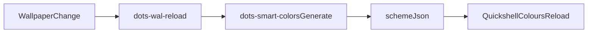

# Hyprland Setup Guide

## Overview

HorneroConfig uses a Hyprland + Quickshell stack.
Quickshell is the primary shell surface for launcher, session menu, dashboard, notifications, and control center.
The default tiling behavior is Hyprland `scrolling` layout (Niri-style column workflow).

## Installation

```bash
chezmoi apply
```

Primary install scripts:

- `home/.chezmoiscripts/linux/run_onchange_before_install-hyprland.sh.tmpl`
- `home/.chezmoiscripts/linux/run_onchange_before_install-packages.sh.tmpl`
- `home/.chezmoiscripts/linux/run_onchange_before_install-quickshell.sh.tmpl`

## First Run

```bash
dots wal-reload
dots appearance apply neon-city
```

## Core Paths

- Hyprland config: `~/.config/hypr/`
- Quickshell config: `~/.config/quickshell/`
- Smart colors cache: `~/.cache/dots/smart-colors/`

## Core Commands

```bash
dots-quickshell start
dots-quickshell ipc launcher toggle
dots-quickshell ipc session toggle
dots-quickshell ipc utilities toggle
dots settings-gui
```

## Theme and Color Workflow



## Troubleshooting

```bash
# Check shell status
dots-quickshell status

# Restart shell
dots-quickshell restart

# Reload Hyprland config
hyprctl reload
```

## Notes

- Legacy Waybar/EWW/JGMenu flows are removed from the maintained setup.
- Use Quickshell IPC and `dots appearance` as the primary interaction layer.
