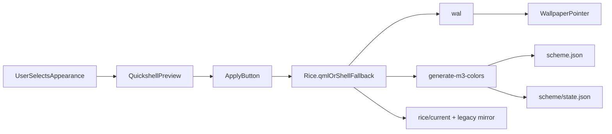

# Rice System: Theme Management

The rice system is managed through the Quickshell-first appearance workflow.

## Canonical Commands

```bash
dots appearance list
dots appearance current
dots appearance apply neon-city
dots appearance set-variant vibrant
dots appearance set-mode dark
dots appearance set-wallpaper /path/to/wallpaper.jpg
dots appearance doctor   # consistency check for rice/scheme/wallpaper pointers
```

`dots rice ...` is retained as compatibility naming, but `dots appearance ...` is the canonical interface.

When Quickshell is running, apply/set-wallpaper go through IPC into `Rice.qml`.
When Quickshell is not running, the same full pipeline runs via `apply-appearance.sh` (wal → pointer → M3 → `scheme/state.json` → GTK/hypr side effects).

## What a Rice Controls

- wallpaper selection (`backgrounds/`, first sorted image by default)
- smart-colors / M3 palette generation (`schemeType`, `darkMode`)
- light/dark mode and M3 variant
- GTK theme metadata (`gtkTheme`, including `auto`)
- optional Hyprland animation profile / kitty opacity
- Quickshell-facing appearance state

Fields such as `barPosition` / `iconTheme` / `cursorTheme` / `accentColor` are metadata for now; shell bar layout remains controlled by Quickshell shell config, not rice apply.

## State (single source of truth)

| Concern           | Canonical path                           | Notes                                                                                                 |
|-------------------|------------------------------------------|-------------------------------------------------------------------------------------------------------|
| Current rice id   | `~/.local/state/dots/rice/current`       | Mirrored to `~/.local/share/dots/rices/.current_rice` and `~/.cache/dots/current_rice` on every write |
| Wallpaper pointer | `~/.local/state/dots/wallpaper/path`     | One absolute path per line                                                                            |
| Live scheme       | `~/.cache/dots/smart-colors/scheme.json` | Consumed by `Colours.qml`                                                                             |
| Scheme prefs      | `~/.local/state/dots/scheme/state.json`  | Must match scheme meta after apply (`dots-color-scheme sync-state`)                                   |

```bash
# Heal / verify
dots appearance doctor
dots-color-scheme sync-state
```

## Quickshell Integration

Control Center → Appearance:

1. Hover / click **stages** a preview (palette + wallpaper preview).
2. Explicit **Apply** (check icon) commits staged rice / scheme / mode / wallpaper changes via `Rice.apply` / `dots-color-scheme`.
3. Launcher rice selector still applies immediately on confirm (intentional quick path).



## Structure

Rices live under:

`~/.local/share/dots/rices/<rice-name>/`

Typical files:

- `config.json` — canonical config consumed by Quickshell's `list-rices.py` and `Rice.qml`
- `config.sh` — shell-sourceable mirror (GTK / snappy / lockscreen helpers)
- `backgrounds/` — wallpaper images (PNG/JPG/WEBP/GIF/BMP; symlinks followed)
- `preview.png` — thumbnail for the rice selector

## Catppuccin Variants

All four official Catppuccin flavours are available as rices, grouped under the `catppuccin` tag in the launcher:

| Rice                   | Mode  | Base      | Accent (Mauve) | Best for                            |
|------------------------|-------|-----------|----------------|-------------------------------------|
| `catppuccin-latte`     | light | `#eff1f5` | `#8839ef`      | Daytime coding, bright environments |
| `catppuccin-frappe`    | dark  | `#303446` | `#ca9ee6`      | Balanced dark, everyday desktop     |
| `catppuccin-macchiato` | dark  | `#24273a` | `#c6a0f6`      | Deep dark, evening sessions         |
| `catppuccin-mocha`     | dark  | `#1e1e2e` | `#cba6f7`      | Cozy dark, creative work            |

```bash
dots appearance apply catppuccin-frappe
dots appearance apply catppuccin-macchiato
```

## Notes

- Legacy Rofi/JGMenu theme selectors were removed from the maintained path.
- The maintained desktop path is Hyprland + Quickshell.
- Wallpaper display is Quickshell Background (layershell), not swww/hyprpaper.
- Colour generation uses pywal + `generate-m3-colors.py` (Material You). There is no wpgtk requirement on the maintained path.
- Related tracking: <https://github.com/ulises-jeremias/dotfiles/issues/249>
