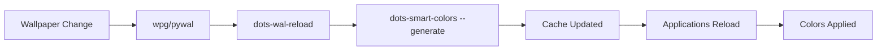

# 🎨 Smart Colors System

The smart colors system provides **theme-adaptive color selection** that automatically finds the best colors for different concepts (error, success, info, etc.) from any color palette, ensuring optimal readability and visual hierarchy regardless of your current theme.

> [!TIP]
> Instead of hardcoded colors that may not work well with all themes, smart colors **intelligently analyze** your current palette and select the most appropriate colors for each semantic concept.

---

## 📋 Overview

### What Smart Colors Solve

Traditional theming approaches often suffer from:

- **Poor contrast** in certain color palettes
- **Hardcoded colors** that don't adapt to themes
- **Semantic inconsistency** (e.g., "error" colors that aren't red-ish)
- **Manual configuration** for each theme

Smart colors automatically solve these issues by:

- **Analyzing your palette** using color science algorithms
- **Finding optimal colors** for each concept from available colors
- **Providing semantic fallbacks** when ideal colors aren't available
- **Integrating seamlessly** with existing applications

---

## 🧠 How It Works

### Color Analysis Algorithm

```bash
# Analyze your current palette
dots-smart-colors --analyze
```

The system uses **advanced color analysis** that combines multiple approaches:

- **Euclidean distance calculations** in RGB color space to find the closest available color to ideal target colors:
  - **Error/Danger**: Targets pure red (255,0,0)
  - **Warning**: Targets orange (255,165,0)
  - **Success**: Targets green (0,255,0)
  - **Info**: Targets blue (0,100,255)
  - **Accent**: Targets purple/violet (128,0,255)

- **🆕 Light/Dark Theme Detection**: Automatically detects theme brightness and optimizes colors accordingly
- **🆕 Foreground Optimization**: Smart foreground selection for optimal readability in light themes

### Smart Selection Process

1. **Theme Detection**: Analyzes background luminance to determine if theme is light (>128/255) or dark
2. **Foreground Optimization**: 
   - **Light themes**: Uses softer foreground colors (e.g., `color5`) instead of harsh black
   - **Dark themes**: Maintains standard foreground colors for optimal contrast
3. **Preference-based selection**: Uses predefined color preferences based on Base16 standards
4. **Distance calculation**: If preferences fail, calculates color distances to find best match
5. **Fallback system**: Always provides a valid color even in limited palettes

### 🔍 Advanced Features

**Automatic Theme Adaptation:**
- **Light Theme Detection**: Background luminance > 128/255 triggers light theme optimizations
- **Smart Foreground**: Light themes use `color5` or `color7` instead of pure black for better readability
- **Contrast Optimization**: Ensures optimal text-to-background contrast ratios
- **Semantic Consistency**: Colors maintain their semantic meaning across all theme types

---

## 🚀 Available Tools

### `dots-smart-colors` Command

#### Basic Usage

```bash
# Quick palette analysis
dots-smart-colors

# Detailed analysis with recommendations
dots-smart-colors --analyze

# Get specific color
dots-smart-colors --concept=error
dots-smart-colors --concept=blue --format=polybar
```

#### Export Formats

**Shell Environment Variables:**

```bash
# Export for shell/scripts
dots-smart-colors --export
eval "$(dots-smart-colors --export)"
```

**Polybar Integration:**

```bash
# Get polybar-format colors
dots-smart-colors --concept=success --format=polybar
# Output: ${xrdb:color10}
```

**EWW SCSS Generation:**

```bash
# Generate complete EWW color file
dots-smart-colors --export --format=eww > ~/.config/eww/dashboard/colors.scss
```

**i3 Configuration:**

```bash
# Generate i3 color variables
dots-smart-colors --export --format=i3 > ~/.config/i3/colors-smart.conf
```

#### Supported Concepts

**Semantic Colors:**

- `error`, `warning`, `success`, `info`, `accent`

**Basic Colors:**

- `red`, `green`, `blue`, `yellow`, `cyan`, `magenta`, `orange`, `pink`, `brown`, `white`, `black`, `gray`

---

## 🗂️ Centralized Cache System (`--generate`)

### The `--generate` Flag

The `--generate` flag is the **core command** that creates all smart color files in a centralized cache directory:

```bash
# Generate all smart color files at once
dots-smart-colors --generate
```

This single command analyzes your current palette and generates **5 specialized files** that different applications can use immediately.

### Cache Directory Structure

All generated files are stored in `~/.cache/dots/smart-colors/`:

```text
~/.cache/dots/smart-colors/
├── colors-i3.conf          # i3 window manager color configuration
├── colors-eww.scss         # EWW widgets SCSS variables  
├── colors.sh               # Shell script variables
├── colors.env              # Environment variables (export format)
└── colors-polybar.conf     # Polybar color configuration
```

### Generated Files Explained

#### 1. **`colors-i3.conf`** - i3 Window Manager
```ini
# i3 color scheme using Base16 + Smart Colors
client.focused          #7e68a0  #7e68a0  #b0d5d8  #0a94bd    #7e68a0
client.focused_inactive #348C9E  #348C9E  #52758A  #348C9E    #348C9E
client.unfocused        #348C9E  #b0d5d8  #52758A  #348C9E    #348C9E
client.urgent           #b84b49  #b84b49  #b0d5d8  #b84b49    #b84b49
```

**Usage**: Include in i3 config with `include ~/.config/i3/colors-smart.conf`

#### 2. **`colors-eww.scss`** - EWW Widgets
```scss
// Enhanced colors with smart semantic variables
$background: #b0d5d8;
$foreground: #52758A;  // Optimized for light themes!

// Smart semantic colors (theme-adaptive)
$error: #b84b49;
$success: #0abf66;
$warning: #b8850f;
$info: #0a94bd;
$accent: #7e68a0;
```

**Usage**: `@import "smart-colors.scss";` in EWW stylesheets

#### 3. **`colors.sh`** - Shell Scripts
```bash
# Shell variables for scripts
color_error='#b84b49'
color_success='#0abf66'
color_warning='#b8850f'
color_info='#0a94bd'
color_accent='#7e68a0'
```

**Usage**: `source ~/.cache/dots/smart-colors/colors.sh` in shell scripts

#### 4. **`colors.env`** - Environment Variables
```bash
# Export-ready environment variables
export COLOR_ERROR='#b84b49'
export COLOR_SUCCESS='#0abf66'
export COLOR_WARNING='#b8850f'
export COLOR_INFO='#0a94bd'
export COLOR_ACCENT='#7e68a0'
```

**Usage**: `source ~/.cache/dots/smart-colors/colors.env` to load into environment

#### 5. **`colors-polybar.conf`** - Polybar Status Bar
```ini
[colors]
background = #b0d5d8
foreground = #52758A  ; Optimized for light themes
primary = #348C9E

; Smart semantic colors
success = #0abf66
warning = #b8850f
error = #b84b49
info = #0a94bd
accent = #7e68a0
```

**Usage**: `include-file = ~/.cache/dots/smart-colors/colors-polybar.conf`

### 🔄 Automatic Workflow

The centralized cache system works seamlessly with the dotfiles workflow:



**Key Benefits:**

1. **Single Source of Truth**: All applications use the same optimized colors
2. **Performance**: Generated once, used everywhere - no repeated calculations
3. **Consistency**: Colors are guaranteed to be semantically correct across all apps
4. **Automatic Updates**: Cache refreshes whenever wallpaper changes

### 📱 Application Integration

Each application type uses its preferred format:

| Application | File Used | Integration Method |
|-------------|-----------|-------------------|
| **i3 WM** | `colors-i3.conf` | Include directive in i3 config |
| **EWW Widgets** | `colors-eww.scss` | SCSS import in stylesheets |
| **Polybar** | `colors-polybar.conf` | Include directive in polybar config |
| **Shell Scripts** | `colors.sh` or `colors.env` | Source in scripts or profiles |
| **Custom Apps** | Any format | Choose the most appropriate format |

### 🔧 Manual Cache Management

```bash
# Generate/refresh cache manually
dots-smart-colors --generate

# Check cache status
ls -la ~/.cache/dots/smart-colors/

# View specific file
cat ~/.cache/dots/smart-colors/colors-polybar.conf

# Clear cache (will be regenerated automatically)
rm -rf ~/.cache/dots/smart-colors/
```

---

## 🔄 Automatic Integration

### Wal-Reload Integration

Smart colors are **automatically applied** when you change wallpapers via `wpg`:


**No manual configuration needed!**

### What Gets Updated Automatically

**EWW Widgets:**

- Replaces pywal symlinks with smart-generated `colors.scss`
- Includes semantic variables (`$error`, `$success`)
- Maintains compatibility with existing configs

**Polybar:**

- Exports smart colors to environment variables
- All modules automatically use optimal colors
- Automatic restart to apply new colors

**i3 Window Manager:**

- Generates `~/.config/i3/colors-smart.conf`
- Provides smart color variables for window theming
- Include with: `include ~/.config/i3/colors-smart.conf`

**Scripts:**

- All polybar scripts use smart colors when available
- Fallback to xrdb if smart colors not available

---

## 🎯 Usage Examples

### Polybar Module Development

```ini
[module/my-module]
type = internal/cpu
format-prefix-foreground = ${colors.accent}    # Smart accent color
label-foreground = ${colors.info}              # Smart info color
format-warn-foreground = ${colors.warning}     # Smart warning color
```

### EWW Widget Styling

```scss
@import "colors.scss";

.error-button {
  background-color: $error; // Always optimal error color
}

.success-message {
  color: $success; // Always optimal success color
}

.info-text {
  color: $info; // Always optimal info color
}
```

### Shell Scripts

```bash
#!/bin/bash
# Load smart colors
eval "$(dots-smart-colors --export)"

echo -e "\\033[${COLOR_ERROR}mError message\\033[0m"
echo -e "\\033[${COLOR_SUCCESS}mSuccess message\\033[0m"
```

### i3 Configuration

```ini
# Include smart colors
include ~/.config/i3/colors-smart.conf

# Use smart colors in window theming
client.focused          $smart_accent  $smart_accent  $background     $smart_info    $smart_accent
client.urgent           $smart_error   $smart_error   $background     $smart_error   $smart_error
```

---

## 🔧 Advanced Configuration

### Environment Variables

You can override smart colors for specific applications:

```bash
export POLYBAR_THEME_ACCENT="#ff0000"      # Force specific accent color
export POLYBAR_THEME_SUCCESS="#00ff00"     # Force specific success color
```

### Custom Color Mappings

Smart colors work with any Base16-compatible color scheme and automatically adapt to:

- **Dark themes**: Prioritizes lighter colors for text, darker colors for backgrounds
- **Light themes**: Prioritizes darker colors for text, lighter colors for backgrounds  
- **🆕 Light theme foreground optimization**: Automatically selects softer foreground colors (like `color5`) instead of harsh black (`#000000`) for better readability
- **High contrast themes**: Maximizes color differences for accessibility
- **Limited palettes**: Finds best available approximations

### Light Theme Intelligence

The system now includes **advanced light theme detection**:

```bash
# The system automatically detects light themes based on background luminance
# Light themes (background luminance > 128/255) get optimized foreground colors

# Example optimizations for light themes:
# - Background: #f0f0f0 (light)
# - Original foreground: #000000 (harsh black)  
# - Optimized foreground: #52758A (softer, more readable)
```

**Benefits of Light Theme Optimization:**
- **Reduced eye strain**: Softer foreground colors in light themes
- **Better readability**: Optimal contrast without being harsh
- **Consistent experience**: Semantic colors work perfectly in both light and dark themes
- **Automatic detection**: No manual configuration needed

---

## 🐛 Troubleshooting

### Common Issues

**Smart colors not applying:**

```bash
# Check if dots-smart-colors is available
which dots-smart-colors

# Test smart color generation
dots-smart-colors --analyze
```

**Polybar not using smart colors:**

```bash
# Check if environment variables are set
env | grep SMART_COLOR

# Manually apply and restart polybar
eval "$(dots-smart-colors --export)"
dots toggle polybar
```

**EWW widgets using old colors:**

```bash
# Check if colors.scss exists and is not a symlink
ls -la ~/.config/eww/dashboard/colors.scss

# Manually regenerate
dots-smart-colors --export --format=eww > ~/.config/eww/dashboard/colors.scss
eww reload
```

**Cache issues:**

```bash
# Check cache directory exists and has files
ls -la ~/.cache/dots/smart-colors/

# Regenerate cache manually
dots-smart-colors --generate

# Check permissions
chmod -R 755 ~/.cache/dots/smart-colors/
```

### Debug Mode

```bash
# Verbose analysis
dots-smart-colors --analyze --verbose

# Check what would be applied without changing anything
dots-wal-reload --dry-run  # (if implemented)

# Test individual color concepts
dots-smart-colors --concept=error
dots-smart-colors --concept=success
```

---

## 📚 Related Documentation

- [Rice System Theme Management](Rice-System-Theme-Management.md) - Complete theme switching
- [Polybar Configuration Structure](Polybar-Configuration-Structure.md) - Polybar color system
- [EWW Widgets](EWW-Widgets.md) - EWW theming integration
- [Dots Scripts](Dots-Scripts.md) - Available dots commands
