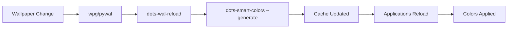
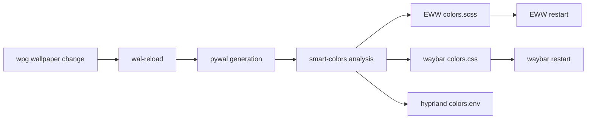

# 🎨 Smart Colors System

The smart colors system provides **theme-adaptive color selection** that automatically finds the best colors for different concepts (error, success, info, etc.) from any color palette, ensuring optimal readability and visual hierarchy regardless of your current theme.

> [!TIP]
> Instead of hardcoded colors that may not work well with all themes, smart colors **intelligently analyze** your current palette and select the most appropriate colors for each semantic concept.

---

## 📋 Overview

### What Smart Colors Solve

Traditional theming approaches often suffer from:

- **Poor contrast** in certain color palettes
- **Hardcoded colors** that don't adapt to themes
- **Semantic inconsistency** (e.g., "error" colors that aren't red-ish)
- **Manual configuration** for each theme

Smart colors automatically solve these issues by:

- **Analyzing your palette** using color science algorithms
- **Finding optimal colors** for each concept from available colors
- **Providing semantic fallbacks** when ideal colors aren't available
- **Integrating seamlessly** with existing applications

---

## 🧠 How It Works

### 🆕 **Enhanced Theme-Adaptive Color Analysis**

```bash
# Analyze your current palette with new theme-adaptive features
dots-smart-colors --analyze --colors
```

The system now uses **revolutionary dual-mode color analysis** that automatically detects your theme type and adapts all colors accordingly:

#### **🌙 Dark Theme Optimization:**

- **Brighter, more saturated colors** for better contrast on dark backgrounds
- **Enhanced visibility** with optimized luminance levels
- **Example**: `info` uses bright cyan `#00dddd` instead of muted blue

#### **☀️ Light Theme Optimization:**

- **Darker, more subdued colors** for comfortable reading on light backgrounds
- **Reduced saturation** to prevent visual strain
- **Example**: `info` uses deep blue `#0066cc` instead of bright cyan

#### **Intelligent Color Mapping:**

- **Error/Danger**: Dark themes → `#ff5555`, Light themes → `#cc0000`
- **Warning**: Dark themes → `#ffaa00`, Light themes → `#cc6600`
- **Success**: Dark themes → `#55dd55`, Light themes → `#008800`
- **Info**: Dark themes → `#00dddd`, Light themes → `#0066cc`
- **Accent**: Dark themes → `#bb77ff`, Light themes → `#663399`

#### **🆕 Background & Foreground Variants:**

Four new smart concepts for better UI consistency:

- **`background`**: Primary background color
- **`background-alt`**: Secondary/accent background (usually color1)
- **`foreground`**: Primary text color (theme-optimized)
- **`foreground-alt`**: Secondary text color (usually color5 for subtle elements)

### Smart Selection Process

1. **Theme Detection**: Analyzes background luminance to determine if theme is light (>128/255) or dark
2. **Foreground Optimization**:
   - **Light themes**: Uses softer foreground colors (e.g., `color5`) instead of harsh black
   - **Dark themes**: Maintains standard foreground colors for optimal contrast
3. **Preference-based selection**: Uses predefined color preferences based on Base16 standards
4. **Distance calculation**: If preferences fail, calculates color distances to find best match
5. **Fallback system**: Always provides a valid color even in limited palettes

### 🔍 Advanced Features

**Automatic Theme Adaptation:**

- **Light Theme Detection**: Background luminance > 128/255 triggers light theme optimizations
- **Smart Foreground**: Light themes use `color5` or `color7` instead of pure black for better readability
- **Contrast Optimization**: Ensures optimal text-to-background contrast ratios
- **Semantic Consistency**: Colors maintain their semantic meaning across all theme types

---

## 🚀 Available Tools

### `dots-smart-colors` Command

#### Basic Usage

```bash
# Quick palette analysis
dots-smart-colors

# Detailed analysis with recommendations
dots-smart-colors --analyze

# Get specific color
dots-smart-colors --concept=error
dots-smart-colors --concept=blue --format=polybar
```

#### Export Formats

**Shell Environment Variables:**

```bash
# Export for shell/scripts
dots-smart-colors --export
eval "$(dots-smart-colors --export)"
```

**Polybar Integration:**

```bash
# Get polybar-format colors
dots-smart-colors --concept=success --format=polybar
# Output: ${xrdb:color10}
```

**EWW SCSS Generation:**

```bash
# Generate complete EWW color file
dots-smart-colors --export --format=eww > ~/.config/eww/dashboard/colors.scss
```

**Waybar CSS Generation:**

```bash
# Generate Waybar CSS variables
dots-smart-colors --export --format=waybar > ~/.config/waybar/smart-colors.css
```

#### Supported Concepts

**🆕 Background & Foreground Variants:**

- `background`, `background-alt`, `foreground`, `foreground-alt`

**Semantic Colors (Theme-Adaptive):**

- `error`, `warning`, `success`, `info`, `accent`

**Basic Colors (Theme-Adaptive):**

- `red`, `green`, `blue`, `yellow`, `cyan`, `magenta`, `orange`, `pink`, `brown`, `white`, `black`, `gray`

---

## 🗂️ Centralized Cache System (`--generate`)

### The `--generate` Flag

The `--generate` flag is the **core command** that creates all smart color files in a centralized cache directory:

```bash
# Generate all smart color files at once
dots-smart-colors --generate
```

This single command analyzes your current palette and generates **5 specialized files** that different applications can use immediately.

### Cache Directory Structure

All generated files are stored in `~/.cache/dots/smart-colors/`:

```text
~/.cache/dots/smart-colors/
├── colors-i3.conf          # i3 window manager color configuration
├── colors-eww.scss         # EWW widgets SCSS variables
├── colors.sh               # Shell script variables
├── colors.env              # Environment variables (export format)
└── colors-polybar.conf     # Polybar color configuration
```

### Generated Files Explained

#### 1. **`colors-i3.conf`** - i3 Window Manager

```ini
# i3 color scheme using Base16 + Smart Colors
client.focused          #7e68a0  #7e68a0  #b0d5d8  #0a94bd    #7e68a0
client.focused_inactive #348C9E  #348C9E  #52758A  #348C9E    #348C9E
client.unfocused        #348C9E  #b0d5d8  #52758A  #348C9E    #348C9E
client.urgent           #b84b49  #b84b49  #b0d5d8  #b84b49    #b84b49
```

**Usage**: Include in i3 config with `include ~/.config/i3/colors-smart.conf`

#### 2. **`colors-eww.scss`** - EWW Widgets

```scss
// Enhanced colors with smart semantic variables
$background: #b0d5d8;
$foreground: #52758a; // Optimized for light themes!

// Smart semantic colors (theme-adaptive)
$error: #b84b49;
$success: #0abf66;
$warning: #b8850f;
$info: #0a94bd;
$accent: #7e68a0;
```

**Usage**: `@import "smart-colors.scss";` in EWW stylesheets

#### 3. **`colors.sh`** - Shell Scripts

```bash
# Shell variables for scripts
color_error='#b84b49'
color_success='#0abf66'
color_warning='#b8850f'
color_info='#0a94bd'
color_accent='#7e68a0'
```

**Usage**: `source ~/.cache/dots/smart-colors/colors.sh` in shell scripts

#### 4. **`colors.env`** - Environment Variables

```bash
# Export-ready environment variables
export COLOR_ERROR='#b84b49'
export COLOR_SUCCESS='#0abf66'
export COLOR_WARNING='#b8850f'
export COLOR_INFO='#0a94bd'
export COLOR_ACCENT='#7e68a0'
```

**Usage**: `source ~/.cache/dots/smart-colors/colors.env` to load into environment

#### 5. **`colors-waybar.css`** - Waybar Status Bar

```css
/* CSS variables for Waybar styling */
@define-color background #b0d5d8;
@define-color foreground #52758A;  /* Optimized for light themes */
@define-color primary #348C9E;

/* Smart semantic colors */
@define-color success #0abf66;
@define-color warning #b8850f;
@define-color error #b84b49;
@define-color info #0a94bd;
@define-color accent #7e68a0;
```

**Usage**: `@import "~/.cache/dots/smart-colors/colors-waybar.css";` in Waybar stylesheet

### 🔄 Automatic Workflow

The centralized cache system works seamlessly with the dotfiles workflow:



**Key Benefits:**

1. **Single Source of Truth**: All applications use the same optimized colors
2. **Performance**: Generated once, used everywhere - no repeated calculations
3. **Consistency**: Colors are guaranteed to be semantically correct across all apps
4. **Automatic Updates**: Cache refreshes whenever wallpaper changes

### 📱 Application Integration

Each application type uses its preferred format:

| Application       | File Used                   | Integration Method                  |
| ----------------- | --------------------------- | ----------------------------------- |
| **Hyprland**      | `colors.env`                | Environment variables in config     |
| **Waybar**        | `colors-waybar.css`         | CSS import in stylesheet            |
| **EWW Widgets**   | `colors-eww.scss`           | SCSS import in stylesheets          |
| **Shell Scripts** | `colors.sh` or `colors.env` | Source in scripts or profiles       |
| **Custom Apps**   | Any format                  | Choose the most appropriate format  |

### 🔧 Manual Cache Management

```bash
# Generate/refresh cache manually
dots-smart-colors --generate

# Check cache status
ls -la ~/.cache/dots/smart-colors/

# View specific file
cat ~/.cache/dots/smart-colors/colors-waybar.css

# Clear cache (will be regenerated automatically)
rm -rf ~/.cache/dots/smart-colors/
```

---

## 🔄 Automatic Integration

### Wal-Reload Integration

Smart colors are **automatically applied** when you change wallpapers via `wpg`:



**No manual configuration needed!**

### What Gets Updated Automatically

**EWW Widgets:**

- Replaces pywal symlinks with smart-generated `colors.scss`
- Includes semantic variables (`$error`, `$success`)
- Maintains compatibility with existing configs

**Waybar:**

- Generates CSS variables file for theming
- All modules automatically use optimal colors
- Automatic restart to apply new colors

**Hyprland:**

- Colors loaded via environment variables
- Automatic reload without restart
- Seamless theme integration

**Scripts:**

- All scripts use smart colors when available
- Fallback to pywal if smart colors not available

---

## 🎯 Usage Examples

### Waybar Module Styling

```css
@import "~/.cache/dots/smart-colors/colors-waybar.css";

#cpu {
  color: @info;              /* Smart info color */
}

#battery.warning {
  color: @warning;           /* Smart warning color */
}

#battery.critical {
  color: @error;             /* Smart error color */
}
```

### EWW Widget Styling

```scss
@import "colors.scss";

.error-button {
  background-color: $error; // Always optimal error color
}

.success-message {
  color: $success; // Always optimal success color
}

.info-text {
  color: $info; // Always optimal info color
}
```

### Shell Scripts

```bash
#!/bin/bash
### Shell Scripts

```bash
#!/bin/bash
# Load smart colors
eval "$(dots-smart-colors --export)"

echo -e "\\033[${COLOR_ERROR}mError message\\033[0m"
echo -e "\\033[${COLOR_SUCCESS}mSuccess message\\033[0m"
```

---

## 🔧 Advanced Configuration

### Environment Variables

You can override smart colors for specific applications:

```bash
export THEME_ACCENT="#ff0000"      # Force specific accent color
export THEME_SUCCESS="#00ff00"     # Force specific success color
```

### Custom Color Mappings

Smart colors work with any Base16-compatible color scheme and automatically adapt to:

- **Dark themes**: Prioritizes lighter colors for text, darker colors for backgrounds
- **Light themes**: Prioritizes darker colors for text, lighter colors for backgrounds
- **🆕 Light theme foreground optimization**: Automatically selects softer foreground colors (like `color5`) instead of harsh black (`#000000`) for better readability
- **High contrast themes**: Maximizes color differences for accessibility
- **Limited palettes**: Finds best available approximations

### Light Theme Intelligence

The system now includes **advanced light theme detection**:

```bash
# The system automatically detects light themes based on background luminance
# Light themes (background luminance > 128/255) get optimized foreground colors

# Example optimizations for light themes:
# - Background: #f0f0f0 (light)
# - Original foreground: #000000 (harsh black)
# - Optimized foreground: #52758A (softer, more readable)
```

**Benefits of Light Theme Optimization:**

- **Reduced eye strain**: Softer foreground colors in light themes
- **Better readability**: Optimal contrast without being harsh
- **Consistent experience**: Semantic colors work perfectly in both light and dark themes
- **Automatic detection**: No manual configuration needed

---

## 🐛 Troubleshooting

### Common Issues

**Smart colors not applying:**

```bash
# Check if dots-smart-colors is available
which dots-smart-colors

# Test smart color generation
dots-smart-colors --analyze
```

**Polybar not using smart colors:**

```bash
# Check if environment variables are set
env | grep SMART_COLOR

# Manually apply and restart polybar
eval "$(dots-smart-colors --export)"
dots toggle polybar
```

**EWW widgets using old colors:**

```bash
# Check if colors.scss exists and is not a symlink
ls -la ~/.config/eww/dashboard/colors.scss

# Manually regenerate
dots-smart-colors --export --format=eww > ~/.config/eww/dashboard/colors.scss
eww reload
```

**Cache issues:**

```bash
# Check cache directory exists and has files
ls -la ~/.cache/dots/smart-colors/

# Regenerate cache manually
dots-smart-colors --generate

# Check permissions
chmod -R 755 ~/.cache/dots/smart-colors/
```

### Debug Mode

```bash
# Verbose analysis
dots-smart-colors --analyze --verbose

# Check what would be applied without changing anything
dots-wal-reload --dry-run  # (if implemented)

# Test individual color concepts
dots-smart-colors --concept=error
dots-smart-colors --concept=success
```

---

## 📚 Related Documentation

- [Rice System Theme Management](Rice-System-Theme-Management.md) - Complete theme switching
- [Polybar Configuration Structure](Polybar-Configuration-Structure.md) - Polybar color system
- [EWW Widgets](EWW-Widgets.md) - EWW theming integration
- [Dots Scripts](Dots-Scripts.md) - Available dots commands
