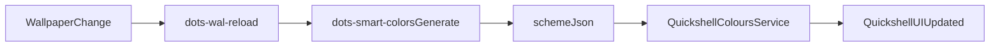

# Smart Colors System

Smart Colors generates semantic colors and Material Design 3 palettes from the current wallpaper, then keeps Quickshell synchronized.

## Primary Contract

- Quickshell is the main consumer through `~/.cache/dots/smart-colors/scheme.json`.
- `dots-wal-reload` and `dots-hyprpaper-set` trigger palette refresh and Quickshell IPC reload.
- Script consumers can source shell/env exports from the same cache directory.

## Main Commands

```bash
dots-smart-colors --generate --m3
dots-smart-colors --analyze
dots-smart-colors --concept=error
dots-wal-reload
```

## Generated Cache

All generated files are written to `~/.cache/dots/smart-colors/`.

Core files:

- `scheme.json` (Quickshell M3 palette)
- `colors.sh` (shell variables for scripts)
- `colors.env` (export-friendly environment file)
- `colors-hyprlock.env` (lockscreen integration)
- `colors-kitty.conf` (terminal integration)
- `colors.css` (generic CSS variables)

Compatibility files may exist for external tooling, but they are not part of the primary UX contract.

## Data Flow



## Troubleshooting

```bash
# Rebuild smart-colors cache
dots-smart-colors --generate --m3

# Confirm cache files exist
ls -la ~/.cache/dots/smart-colors/

# Force shell-side reload path
dots-quickshell ipc colours reload
```

## Notes

- Legacy Waybar/EWW/Rofi integrations are no longer part of the maintained path.
- The supported default stack is Hyprland + Quickshell.
