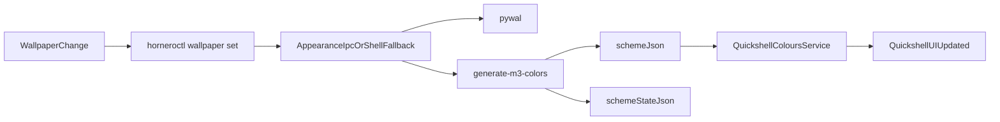

# Smart Colors System

Smart Colors generates semantic colors and Material Design 3 palettes from the current wallpaper, then keeps Quickshell synchronized.

## Primary Contract

- Quickshell is the main consumer through `~/.cache/dots/smart-colors/scheme.json`.
- `horneroctl wallpaper reload --yes` and `horneroctl wallpaper set` trigger palette refresh and Quickshell IPC reload.
- M3 generation goes through `horneroctl appearance colors m3 --yes` (prefers `/usr/bin/python3` when it has `materialyoucolor`, so pyenv shims do not break the pipeline).
- Script consumers can source shell/env exports from the same cache directory.

## Wallpaper Pipeline Contract

### Maintained path (Hyprland + Quickshell)

1. `horneroctl wallpaper set <image>` (or Control Center Apply / `appearance.setWallpaper`)
2. When Quickshell is running → IPC `appearance setWallpaper`
3. Otherwise → `apply-appearance.sh` wallpaper-only path:
   - `wal -i` (honors light/dark from scheme state)
   - write `~/.local/state/dots/wallpaper/path` (canonical pointer)
   - rewrite `~/.cache/wal/wal` as a **text path file** (never an image symlink)
   - `generate-m3-colors.py` → `scheme.json`
   - `horneroctl appearance scheme sync-state --yes` → `scheme/state.json` (preserves `gtkColorScheme`)
   - `horneroctl appearance gtk sync-color-scheme --yes` re-applies the persisted GTK policy (`follow` tracks Theme mode; sticky `prefer-light` / `prefer-dark` / `default` are left alone)
4. `Colours.qml` reloads via file watch or `horneroctl shell ipc -- call colours reload` (real IPC + touch fallback)

### Wallpaper resolution priority

1. Explicit argument
2. `~/.local/state/dots/wallpaper/path` (canonical persistent pointer)
3. `~/.cache/wal/wal` (text path file; last resort — not a symlink)

## Main Commands

```bash
horneroctl appearance colors generate --m3 --yes
horneroctl appearance colors status
horneroctl appearance colors concept --help
horneroctl wallpaper reload --yes
```

## Generated Cache

All generated files are written to `~/.cache/dots/smart-colors/`.

Core files:

- `scheme.json` (Quickshell M3 palette)
- `colors.sh` (shell variables for scripts)
- `colors.env` (export-friendly environment file)
- `colors-hyprlock.env` (lockscreen integration)
- `colors-kitty.conf` (terminal integration)
- `colors.css` (generic CSS variables)

Compatibility files may exist for external tooling, but they are not part of the primary UX contract.

## Data Flow


```mermaid
flowchart LR
  wallpaper[WallpaperChange] --> set[horneroctl wallpaper set]
  set --> appearance[AppearanceIpcOrShellFallback]
  appearance --> wal[pywal]
  appearance --> m3[generate-m3-colors]
  m3 --> scheme[schemeJson]
  m3 --> state[schemeStateJson]
  scheme --> colours[QuickshellColoursService]
  colours --> ui[QuickshellUIUpdated]
```

## Troubleshooting

```bash
# Rebuild smart-colors cache
horneroctl appearance colors generate --m3 --yes

# Confirm cache files exist
ls -la ~/.cache/dots/smart-colors/

# Force shell-side reload path
horneroctl shell ipc -- call colours reload

# Confirm appearance consistency
horneroctl appearance doctor
```

See also: [Appearance Themes](Rice-System-Theme-Management.md)
